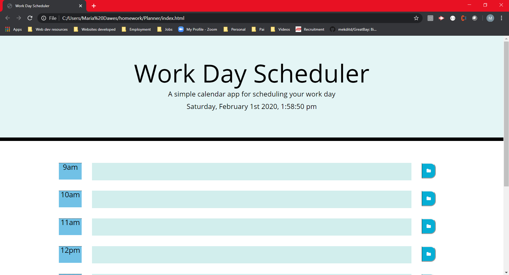

# Day Planner
Create a simple calendar application that allows the user to save events for each hour of the day. This app will run in the browser and feature dynamically updated HTML and CSS powered by jQuery.

The app should display standard business hours (9 a.m. to 5 p.m.). Each time slot should represent one hour and contain the following:

* The time

* A field to hold user input

* A save button

Clicking on the save button will store the time and user input in `localStorage`.

Near the top of the calendar, the application should display the current day. Additionally, each hour should be color coded to reflect whether the time slot is in the past, the present, or the future. This will change depending on the time of day.
 

## Motivation
This project is homework05 from UT Coding Bootcamp.

### Prerequisites
The software will run in any webpage.

## Tests 
* Current day/time from api tested.
* Intput task tested.
    
## Screenshots

## Author
Maria Dawes-Tedesco

## Built With
* HTML, CSS, JavaScript, API ([Moment.js](https://momentjs.com/) library)

# Contributing
Please read [CONTRIBUTING.md](https://gist.github.com/PurpleBooth/b24679402957c63ec426) for details on our code of conduct, and the process for submitting pull requests to us.

## Versioning
For the versions available, see https://github.com/MariaDawes/PasswordGenerator/commits/master

## Acknowledgement
Thank you Kevin Geary for help with solving code bugs.
